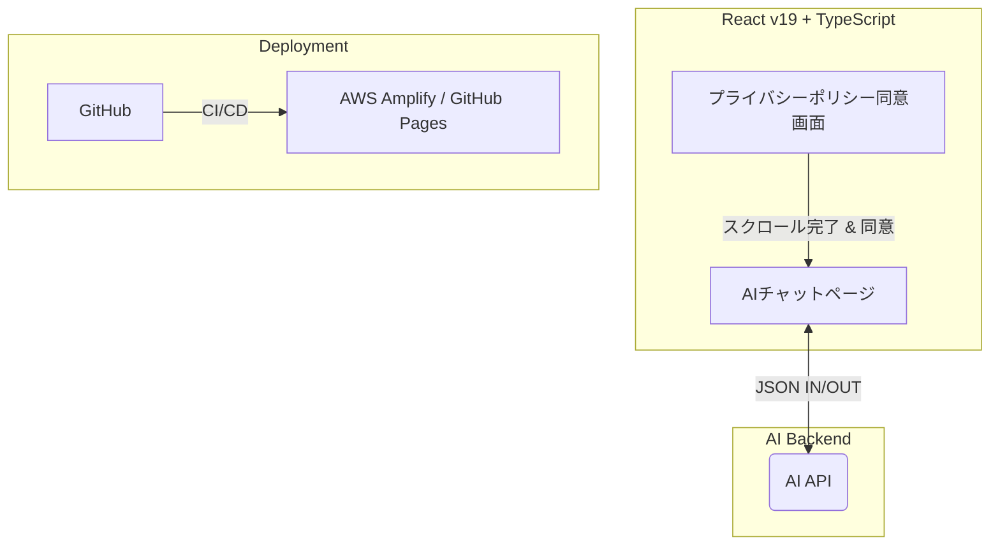

# ジョブサーチ UI/UX 開発ドキュメント

このサイトでは、AIを活用したキャリアパス提案ツール「ジョブサーチ」のフロントエンド設計・実装に関する情報を管理します。

!!! info "プロジェクトの方針"
    本プロジェクトは **Docs as Code** を踏襲しています。
    仕様の変更や新機能の実装時には、コードと同時にこのドキュメントも更新してください。

## 🛠 システム構成

現在のアプリケーションの全体像です。



## 📋 実装ステータス

現在の開発状況です。Materialテーマのタスクリスト機能を活用しています。

- [ ] Phase1:開発環境構築 
    - [x] Vite + React + TypeScript の導入
    - [ ] Tailwind CSS v4 のセットアップ
    - [ ] MkDocs Material テーマ適用
- [ ] Phase2: UI/UX実装
    - [ ] `react-router-dom` による画面遷移設計
    - [ ] プライバシーポリシー同意画面（スクロール検知ロジック）
    - [ ] AIチャット画面（スキル・キャリア入力フォーム）
    - [ ] AIレスポンス表示コンポーネント
- [ ] Phase3: デプロイ・自動化
    - [ ] GitHub Actionsによる自動デプロイパイプラインの構築

## 🚀 開発ガイド

### プロントエンド実行

```bash
# プロジェクトルートにて
npm install
npm run dev
```

### ドキュメントプレビュー

```bash
# プロジェクトルートにて
pip install -r requirements.txt
mkdocs serve
```

!!! tip "Tailwind v4 の注意点" 
    本環境では Tailwind CSS v4 を採用しています。  
    tailwind.config.js ではなく、src/index.css の @import "tailwindcss"; を基点にスタイルを管理します。  
    詳細は setup.md（作成予定）を参照してください。


## API 仕様

### 送信データ（POST /ai-analyze）

```json
{
  "skills": ["TypeScript", "React", "AWS"],
  "career_vision": "将来的に海外でエンジニアとして働きたい",
  "preferences": {
    "work_style": "Remote",
    "industry": "FinTech"
  }
}
```

### 受信データ（Response）

```json
{
  "advice_message": "素晴らしいスキルセットですね。...",
  "recommended_roadmap": [
    "Next.jsの習得",
    "英語での技術ドキュメント執筆"
  ],
  "status": "success"
}
```

## 解析リクエスト (Frontend -> AI)
ユーザーが入力したスキルとキャリアイメージを送信します。

```json
{
  "skills": [
    { "name": "React", "years": "3" },
    { "name": "AWS", "years": "1" }
  ],
  "career_vision": "フルスタックエンジニアとして海外移住したい"
}